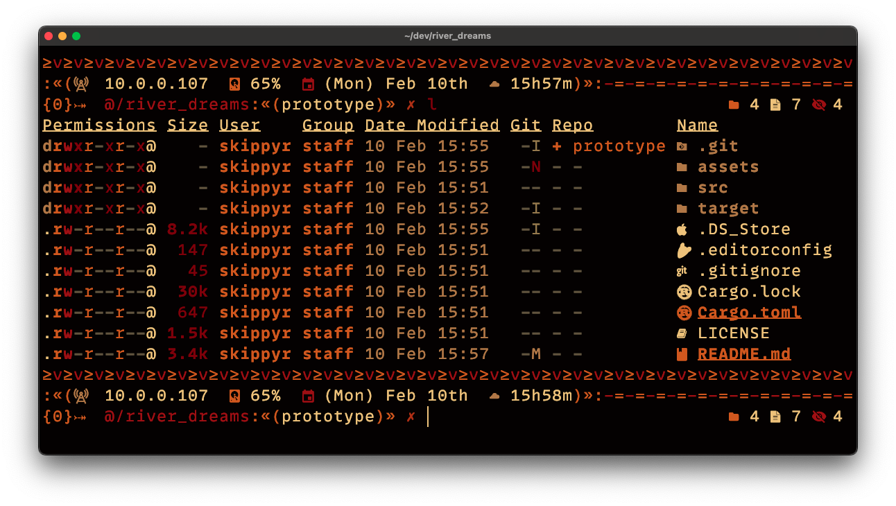

# River Dreams
## About
This repository contains the source code of River Dreams, a tribal inspired theme for the ZSH shell designed to be the required nerd's tool for any development project.

Here is a preview that you can check it out:

> [!NOTE]
> The colors used in this shell theme will depend on your terminal emulator's theme. So they may look different from the preview in your setup.
>
> For same results, use the same theme: [Flamerial](https://github.com/skippyr/flamerial). The font used is [Hack](https://github.com/source-foundry/Hack).



### Features

In the left prompt, you will find:

- Your host name and local IPV4 address. If a valid address is not found, it will show your loopback address: `127.0.0.1`. If you have multiple local network interfaces, it will use the first one that matches its required criterias:
    - It contains an IPV4 address.
    - It is running.
    - It is not a loopback.
- Your storage device usage percentage. It refers to the device that is mounted at `/`.
- A calendar displaying the day of the week, month and day of the month.
- A clock displaying the hours and minutes of the day. Its symbol also changes depending on the moment of the day:

| Symbol    | Moment    | Hours                     |
| --------- | --------- | ------------------------- |
| Telescope | Dawn      | Between 00h00m and 06h00m |
| Sun       | Morning   | Between 06h00m and 12h00m |
| Cloud     | Afternoon | Between 12h00m and 18h00m |
| Moon      | Night     | Between 18h00m and 00h00m |

- A decorator that alerts if you are the root user or not: it will show a hash symbol if you are.
- A decorator that alerts if the last command executed failed or not: it will be a cross-like symbol if it has.
- The name of sourced virtual environments.
- The name of the directory you are currently in. It uses an alias for the home directory, `~`, and if inside a Git repository, it will use a special alias, `@`, to short parent directories and only show the ones from inside that workspace.
- If inside a Git repository, the name of active branch.
- A decorator that alerts about the current directory ownership: it will show a lock symbol if you are not the owner of the current directory, alerting that is read-only.

In the right prompt, you will find:

- A status about the entries in your current directory:
    - the total of hidden entries.
    - the total of symlink entries.
    - the total of executable entries (only including regular files that are not symlinks).
- The quantity of background jobs running.

## Installation
### Dependencies
In order to install this software, the following dependencies must be installed:

- `zsh`: this is the shell this theme applies on.
- `git`: it will be used to clone this repository.
- A font patched by [Nerd Fonts project](https://www.nerdfonts.com/font-downloads) and [Noto Sans](https://fonts.google.com/noto/specimen/Noto+Sans): they provide the pretty symbols used in the theme.
- `make`, a C++ compiler (`g++`, for example) and C POSIX headers: they will be used to compile the source code.

### Procedures
- Clone this repository using `git`.

```bash
git clone --depth 1 https://github.com/skippyr/river-dreams ~/.local/share/zsh/themes/river-dreams
```

- Access the repository's directory.

```bash
cd ~/.local/share/zsh/themes/river-dreams
```

- Compile the source code using `make`.

```bash
make
```

> [!IMPORTANT]
> By default, any compilation will use `g++` as the compiler. However, if you want to use another, you can give it as an argument to `make`. For instance, you can use `clang++` instead:

```bash
make COMPILER=clang++
```

- Add the following rule to your `~/.zshrc` file. Ensure to not source any other theme to avoid conflicts.

```bash
source ~/.local/share/zsh/themes/river-dreams/river-dreams.zsh-theme
```

- Open a new ZSH session. Now the theme should be installed and running.

## Issues And Contributions
You can use its [issues page](https://github.com/skippyr/river-dreams/issues) to provide your feedback, to report any issue you are facing or to ask for help.

You can also fork it and send pull requests to be reviewed.

All kinds of contributions, from people of any skill level, is always appreciated.

## Copyright
This software is under the MIT license. A copy of the license is bundled with the source code.
